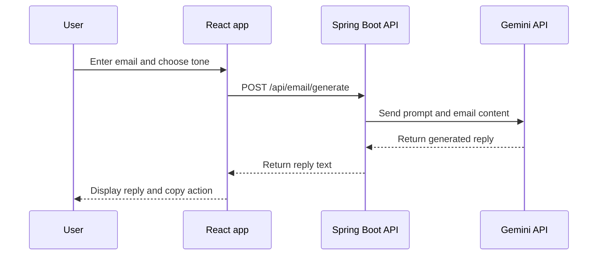

# Email Writer

> Turn an incoming email into a clear, ready-to-send reply.

Email Writer is a small React application for creating AI-assisted email replies. Paste an email, choose a tone, generate a response, and copy it into your inbox.

[](https://react.dev/)
[](https://vite.dev/)
[](https://mui.com/)
[](#)

<p align="center">
  <strong>Write less. Reply better.</strong><br>
  A simple workspace for fast, thoughtful email responses.
</p>

## At a glance

| | What you get |
| --- | --- |
| ✍️ **Write** | Paste an incoming email into a clean multiline editor |
| 🎛️ **Choose** | Select a tone that matches the conversation |
| ⚡ **Generate** | Ask the backend for an AI-assisted reply |
| 📋 **Copy** | Copy the result directly into your email client |
| 🛡️ **Recover** | See loading and error states without losing the page |

## How it works

| Step | Action | Result |
| ---: | --- | --- |
| **1** | 📨 Paste the email you received | The message becomes available to the generator |
| **2** | 🎚️ Choose a tone | The reply style matches the conversation |
| **3** | ✨ Select **Generate Reply** | The backend creates a suggested response |
| **4** | ✅ Review and copy | The reply is ready to paste into your inbox |

The Generate button stays disabled until both required fields are complete. A loading indicator appears while the backend is creating the reply, and connection errors are shown in the interface.

### Available tones

| Tone | Best for |
| --- | --- |
| **Formal** | Official requests, business communication, and sensitive topics |
| **Professional** | Clear workplace replies and everyday business email |
| **Friendly** | Warm, approachable conversations |
| **Informal** | Familiar conversations with teammates or friends |
| **Casual** | Short, relaxed, low-stakes messages |

## Project overview

This repository contains three connected parts:

| Component | Folder | Purpose |
| --- | --- | --- |
| 🌐 Web app | `Email-writer-react/` | React interface described in this README |
| ⚙️ API | `emailwriter/` | Spring Boot service that calls the Gemini API |
| ✉️ Extension | `Email-writer-extension/` | Chrome content script for using Email Writer in Gmail |

## Prerequisites

| Requirement | Why it is needed |
| --- | --- |
| Node.js 18 or newer | Runs the React development tooling |
| npm | Installs frontend dependencies and runs scripts |
| Java and Maven | Runs the Spring Boot backend |
| Gemini API key | Lets the backend generate replies |

The React app expects the backend at:

```text
http://localhost:9090
```

## Run locally

Open two terminals from this folder.

| Terminal | Start | Expected result |
| --- | --- | --- |
| **1. Backend** | `mvnw.cmd spring-boot:run` | API available at `localhost:9090` |
| **2. Frontend** | `npm run dev` | Web app available at `localhost:5173` |

### 1. Start the backend

From the React project directory:

```powershell
cd ..\emailwriter
.\mvnw.cmd spring-boot:run
```

On macOS or Linux:

```bash
cd ../emailwriter
./mvnw spring-boot:run
```

### 2. Start the React app

In a second terminal:

```bash
npm install
npm run dev
```

Open the local URL printed by Vite, usually:

```text
http://localhost:5173
```

Keep both terminals running while using the application.

## API reference

The frontend sends a `POST` request to `/api/email/generate`.

| Property | Value |
| --- | --- |
| Method | `POST` |
| URL | `http://localhost:9090/api/email/generate` |
| Content type | `application/json` |
| Authentication | Gemini credentials are configured by the backend |

### Request

```json
{
  "emailContent": "Could we move our meeting to Thursday?",
  "tone": "Professional"
}
```

### Response

The backend returns the generated reply as a string:

```json
"Thursday works well for me. I have moved the meeting on my calendar."
```

The backend must be running on port `9090`, and the configured Gemini credentials must be valid. The API currently allows cross-origin requests for local development.

## Available commands

Run these commands from `Email-writer-react/`:

| Command | Description |
| --- | --- |
| `npm install` | Install project dependencies |
| `npm run dev` | Start the development server with hot reload |
| `npm run build` | Create a production build in `dist/` |
| `npm run preview` | Preview the production build locally |
| `npm run lint` | Check the code with Oxlint |

### Quick command reference

```text
Install   -> npm install
Develop   -> npm run dev
Validate  -> npm run lint && npm run build
Preview   -> npm run preview
```

Before submitting changes, run:

```bash
npm run lint
npm run build
```

## Tech stack

| Layer | Technology |
| --- | --- |
| 🎨 Interface | React 19 + Material UI |
| 🚀 Tooling | Vite 8 |
| 🔌 HTTP | Axios |
| 🔍 Quality | Oxlint |
| 🧩 Backend | Spring Boot |
| 🤖 Generation | Google Gemini API |

## Request flow



## Project structure

```text
Email-writer-react/
├── public/              # Public static files
├── src/
│   ├── assets/          # Imported assets
│   ├── App.jsx          # Reply-generation interface
│   ├── App.css          # Application styles
│   ├── index.css        # Global styles
│   └── main.jsx         # React entry point
├── index.html            # Vite HTML entry point
├── package.json          # Scripts and dependencies
└── vite.config.js        # Vite configuration
```

## Troubleshooting

| Problem | What to check |
| --- | --- |
| ❌ The request fails or never completes | Confirm the backend is running on port `9090`; then check the browser console and backend terminal for API-key, connection, or CORS errors. |
| ⏸️ Generate Reply is disabled | Enter email content and select a tone. Both fields are required. |
| 🤔 No reply appears | Confirm the backend can reach Gemini and that the request uses `/api/email/generate`. |
| 📋 Clipboard button does not work | Allow clipboard access for the local site and try again in a secure browser context. |

For backend-specific configuration, see the Spring Boot module's `application.properties` file.

## Chrome extension

The optional `Email-writer-extension/` folder contains the Gmail integration. To load it in Chrome:

| Step | Action |
| ---: | --- |
| **1** | Open `chrome://extensions`. |
| **2** | Turn on **Developer mode**. |
| **3** | Select **Load unpacked**. |
| **4** | Choose the `Email-writer-extension/` folder. |
| **5** | Open or refresh Gmail and check that the extension can reach port `9090`. |

The extension and the React app use the same email-generation endpoint.

## Development checklist

Before submitting changes:

- [ ] The frontend starts with `npm run dev`.
- [ ] The backend is reachable on port `9090`.
- [ ] Empty email content cannot be submitted.
- [ ] Each supported tone produces a request.
- [ ] Errors are visible and understandable.
- [ ] `npm run lint` passes.
- [ ] `npm run build` passes.
